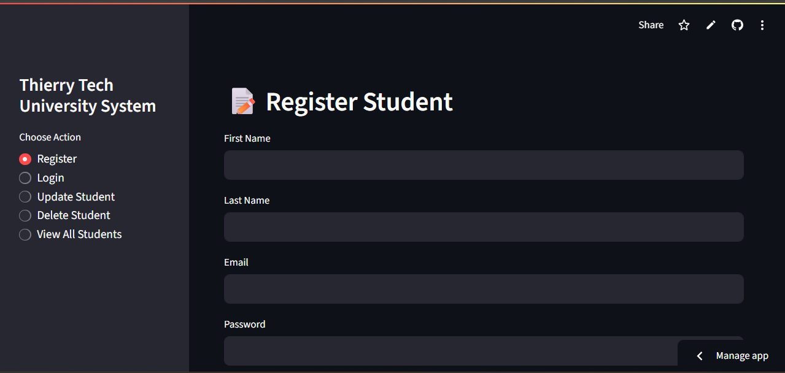

# Streamlit-SQL-University-Database-System

A simple web-based application to manage student data, built using **Streamlit** and **MySQL**.

### ER Model


### Dashboard


## Features

- Register new students  
- Student login and authentication  
- Update student information  
- Delete student records  
- View all registered students  

## Tech Stack

- Python  
- Streamlit  
- MySQL  
- PyMySQL  

## Setup Instructions

1. **Clone the repository**
   ```bash
   git clone https://github.com/DeveloperThierry/Streamlit-SQL-University-Database-System.git
   cd Streamlit-SQL-University-Database-System
   ```

2. **Install dependencies**
   ```bash
   pip install streamlit pymysql
   ```

3. **Configure secrets**
   Create a `.streamlit/secrets.toml` file:
   ```toml
   [mysql]
   host = "your_host"
   user = "your_user"
   password = "your_password"
   database = "your_database"
   port = 3306
   ```

4. **Run the app**
   ```bash
   streamlit run app.py
   ```

## Demo

Watch the full demo here:  
📺 [YouTube Video](https://youtu.be/lKcQ4UL4Frs)
